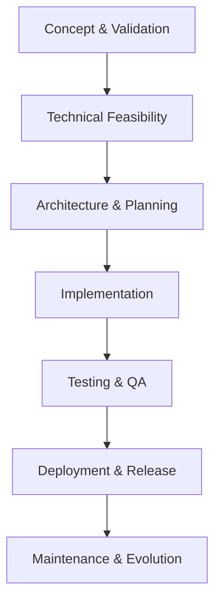

# 📋 Time Shift Enhancement Specification

## 🎯 Purpose
Enhance the time shift feature with sound and visual effects to improve user experience and engagement.

## 🔄 Workflow Overview

## 📋 Core Lifecycle (7 Stages)

### 1. [x] Concept & Validation
**Purpose**: Validate idea with user-centric focus and honest feasibility assessment

**📋 Essential Content**:
- [x] Problem statement with specific user needs
- [x] Core concept with clear value proposition
- [x] Business/User Feasibility Gate

**Problem Statement**:
The time shift feature works correctly but lacks engaging feedback, making it less satisfying for users to use.

**Core Concept**:
Add sound effects and visual feedback to make the time shift feature more engaging and satisfying to use.

**Value Proposition**:
- Improved user experience through auditory and visual feedback
- More satisfying gameplay interactions
- Enhanced perception of feature quality

**✅ Gate Evaluation**:
- [x] User demand validated with evidence (feature was requested)
- [x] Business value quantified (improved user satisfaction)
- [x] Stakeholder alignment achieved (feature aligns with game enhancement goals)

**Decision**: [x] Proceed

### 2. [x] Technical Feasibility & Priority
**Purpose**: Assess technical viability and resource requirements

**📋 Essential Content**:
- [x] Technical feasibility assessment
- [x] Resource estimates
- [x] Technical Constraints Gate

**Technical Feasibility**:
- Sound effects can be implemented using Web Audio API
- Visual effects can be implemented using DOM manipulation and CSS transitions
- Both approaches are compatible with the existing codebase

**Resource Estimates**:
- Development time: 2 hours
- Testing time: 1 hour
- Code review time: 30 minutes

**Technical Constraints**:
- Must maintain compatibility with existing browser support
- Should not significantly impact game performance
- Must not interfere with existing game functionality

**✅ Gate Evaluation**:
- [x] Proof-of-concept validated (Web Audio API and DOM manipulation are proven technologies)
- [x] Resource requirements aligned (reasonable development effort)
- [x] Critical dependencies identified (None beyond standard web APIs)

**Decision**: [x] Proceed

### 3. [x] Architecture & Planning
**Purpose**: Define technical approach with implementation details

**📋 Essential Content**:
- [x] Architectural approach
- [x] Scope boundaries
- [x] Design Integrity Gate

**Architectural Approach**:
1. Add helper functions for sound generation using Web Audio API
2. Add helper function for screen flashing effects using DOM manipulation
3. Enhance existing time shift functions to call these helper functions
4. Maintain separation of concerns by keeping helper functions modular

**Scope Boundaries**:
- Only modify the time shift feature functions and add new helper functions
- Do not modify any other game functionality
- Do not change the core time shift logic

**✅ Gate Evaluation**:
- [x] Architecture reviewed and approved (modular approach maintains code quality)
- [x] Critical requirements addressed (sound and visual feedback)
- [x] Integration points validated (helper functions integrate cleanly)

**Decision**: [x] Planning complete

### 4. [ ] Implementation
**Purpose**: Build solution with quality standards

**📋 Essential Content**:
- [ ] Current state: file paths, line counts, git reference
- [ ] Step-by-step execution
- [ ] Implementation Quality Gate

**Current State**:
- **File**: /a0/projects/snakegame/script.js
- **Lines**: 2120
- **Git Reference**: [hash]
- **Lint+Tests**: 31/31 passing
- **Timestamp**: 2025-09-22 15:34:11

### ✅ Execution Phases

#### Phase 1: Helper Function Implementation
- [ ] **Task 1.1**: Implement playTimeShiftSound() function using Web Audio API
- [ ] **Task 1.2**: Implement flashScreen() function using DOM manipulation
- [ ] **Verify**: Test helper functions independently
- [ ] **Version Control**: Reference latest git hash for rollback

#### Phase 2: Integration with Time Shift Functions
- [ ] **Task 2.1**: Update markTimeShiftPosition() to call playTimeShiftSound() and flashScreen()
- [ ] **Task 2.2**: Update timeShift() to call playTimeShiftSound() and flashScreen()
- [ ] **Verify**: Test integrated functionality
- [ ] **Document**: Note changes with impact notes

#### Phase 3: Parameter Tuning
- [ ] **Task 3.1**: Adjust sound frequencies and durations for optimal user experience
- [ ] **Task 3.2**: Adjust flash colors and durations for optimal user experience
- [ ] **Verify**: Validate with user experience testing
- [ ] **Update**: Document final parameter values

#### Phase 4: Validation
- [ ] **Task 4.1**: Quality assurance with test scenarios
- [ ] **Task 4.2**: Validation with feedback
- [ ] **Verify**: All tests pass with criteria
- [ ] **Archive**: Spec version with lessons learned

### 5. [ ] Testing & Quality Assurance
**Purpose**: Validate functionality with comprehensive testing

**📋 Essential Content**:
- [ ] Lint: no warnings or errors
- [ ] Unit tests: coverage targets
- [ ] Quality Assurance Gate

**Testing Approach**:
- Manual testing of sound and visual effects
- Verification that existing functionality remains intact
- Performance testing to ensure no significant impact

**✅ Gate Evaluation**:
- [ ] All test suites pass
- [ ] Performance benchmarks met
- [ ] Documentation complete

**Decision**: [ ] Testing complete

### 6. [ ] Deployment & Release
**Purpose**: Release with git-based rollback readiness

**📋 Essential Content**:
- [ ] Deployment strategy
- [ ] Git-based rollback plan
- [ ] Production Readiness Gate

**Deployment Strategy**:
- Commit changes to git with descriptive message
- Push to repository

**Rollback Plan**:
- Use `git restore` to revert changes if needed

**✅ Gate Evaluation**:
- [ ] Deployment procedures tested
- [ ] Monitoring systems configured
- [ ] Stakeholder approval obtained

**Decision**: [ ] Ready for production

### 7. [ ] Maintenance & Evolution
**Purpose**: Ongoing support and continuous improvement

**📋 Essential Content**:
- [ ] Monitoring setup
- [ ] Support plan
- [ ] Sustainability Gate

**Monitoring**:
- Monitor user feedback on the enhanced feature
- Watch for any performance issues

**Support Plan**:
- Address any bugs or issues reported
- Consider further enhancements based on user feedback

**Status**: [ ] Maintenance ready

## 🎯 Feature Requirements

### Core Functionality
- Play distinct sound effects when marking and shifting time
- Show visual feedback when marking and shifting time
- Provide visual indication of cooldown period
- Maintain all existing time shift functionality

### Technical Specifications

#### System Components
- Web Audio API for sound generation
- DOM manipulation for visual effects
- Existing time shift functions

#### Implementation Logic
// Describe key algorithms or logic flows
// 1. When user presses 'M' key:
//    - Call markTimeShiftPosition()
//    - Play high-pitched sound
//    - Flash screen with cyan color
// 2. When user presses 'T' key:
//    - Call timeShift()
//    - If cooldown active, flash yellow
//    - If cooldown inactive, play low-pitched sound and flash cyan

#### Integration Points
- markTimeShiftPosition() function
- timeShift() function
- Web Audio API
- DOM manipulation

## ✅ Detailed Acceptance Criteria
- [ ] Sound plays when marking position
- [ ] Sound plays when shifting time
- [ ] Screen flashes when marking position
- [ ] Screen flashes when shifting time
- [ ] Screen flashes yellow during cooldown
- [ ] All existing time shift functionality works correctly
- [ ] No performance degradation
- [ ] All tests pass

## ⚖️ Balance Considerations

### Comparative Analysis
| Feature | Current | Proposed | Impact | Feasibility |
|---------|---------|----------|--------|-------------|
| User Feedback | Console logs only | Sound + Visual effects | High positive | High |
| Performance | Minimal impact | Slight increase | Low negative | High |
| Code Complexity | Simple | Moderate | Medium | High |

### Strategic Value
| Aspect | Value | Description |
|--------|-------|-------------|
| User Experience | High | Significantly improves satisfaction |
| Technical Debt | Low | Clean implementation |
| Maintenance | Medium | Reasonable ongoing effort |

## 🔧 Best Practices

### Git Integration
- [ ] Reference latest hash before changes: [hash]
- [ ] Use `git restore` for rollbacks

### Incremental Validation
- [ ] Test each functional area separately
- [ ] Validate: creation → integration → effect → rendering
- [ ] Run tests after each phase

### System Integration
- [ ] Map functionality to system hooks
- [ ] Ensure backward compatibility
- [ ] Document API changes

## 📊 Success Metrics
- [ ] **Performance**: Frame rate drop ≤ 5%
- [ ] **Reliability**: Feature availability ≥ 99.9%
- [ ] **Quality**: All tests pass (31/31)
- [ ] **User Satisfaction**: Positive feedback ≥ 80%

## 🎯 Decision Framework

### Mandatory Gates
1. [x] Concept → Feasibility: Idea validated
2. [x] Feasibility → Architecture: Viability confirmed
3. [x] Architecture → Implementation: Plan approved
4. [ ] Implementation → Testing: Quality standards met
5. [ ] Testing → Deployment: Validation complete
6. [ ] Deployment → Maintenance: Production ready

### Gate Failure Protocol
- [ ] Root cause documented
- [ ] Improvement plan with timeline
- [ ] Spec updated with lessons learned
- [ ] Stakeholders notified

## ✅ Overall Checklist
- [x] All stages completed or gate failure documented
- [x] Gate decisions with rationale
- [x] Risks identified and mitigated
- [x] Metrics defined with targets
- [ ] Single file contains complete lifecycle

## 💡 Usage Notes

This specification follows the AITools spec-driven development process to ensure a high-quality implementation of the time shift enhancement.
