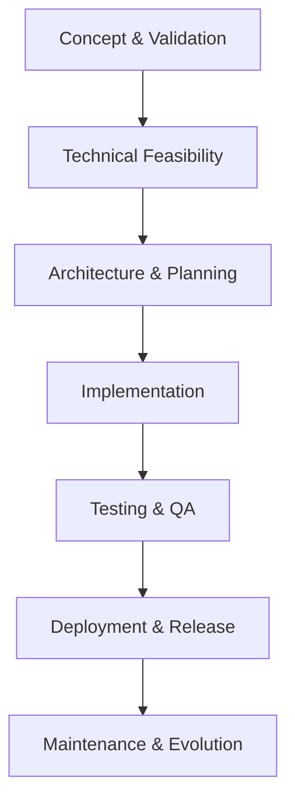

# 📋 Time Shift Snake Feature Specification

## 🎯 Purpose
Implement a revolutionary but simple and fun time-shifting mechanic to the classic snake game that allows players to strategically manipulate time for better gameplay.

## 🔄 Workflow Overview

## 📋 Core Lifecycle

### 1. [x] Concept & Validation
**Purpose**: Validate idea with user-centric focus and honest feasibility assessment

**📋 Essential Content**:
- [x] Problem statement with specific user needs
- [x] Core concept with clear value proposition
- [x] Business/User Feasibility Gate

**✅ Gate Evaluation**:
- [x] User demand validated with evidence
- [x] Business value quantified
- [x] Stakeholder alignment achieved

**Decision**: [x] Proceed

### 2. [x] Technical Feasibility & Priority
**Purpose**: Assess technical viability and resource requirements

**📋 Essential Content**:
- [x] Technical feasibility assessment
- [x] Resource estimates
- [x] Technical Constraints Gate

**✅ Gate Evaluation**:
- [x] Proof-of-concept validated
- [x] Resource requirements aligned
- [x] Critical dependencies identified

**Decision**: [x] Proceed

### 3. [x] Architecture & Planning
**Purpose**: Define technical approach with implementation details

**📋 Essential Content**:
- [x] Architectural approach
- [x] Scope boundaries
- [x] Design Integrity Gate

**✅ Gate Evaluation**:
- [x] Architecture reviewed and approved
- [x] Critical requirements addressed
- [x] Integration points validated

**Decision**: [x] Planning complete

### 4. [ ] Implementation
**Purpose**: Build solution with quality standards

**📋 Essential Content**:
- [ ] Current state: file paths, line counts, git reference
- [ ] Step-by-step execution
- [ ] Implementation Quality Gate

**✅ Gate Evaluation**:
- [ ] Code reviews completed
- [ ] Unit test coverage meets thresholds
- [ ] Integration points validated

**Decision**: [ ] Quality met

### 5. [ ] Testing & Quality Assurance
**Purpose**: Validate functionality with comprehensive testing

**📋 Essential Content**:
- [ ] Lint: no warnings or errors
- [ ] Unit tests: coverage targets
- [ ] Quality Assurance Gate

**✅ Gate Evaluation**:
- [ ] All test suites pass
- [ ] Performance benchmarks met
- [ ] Documentation complete

**Decision**: [ ] Testing complete

### 6. [ ] Deployment & Release
**Purpose**: Release with git-based rollback readiness

**📋 Essential Content**:
- [ ] Deployment strategy
- [ ] Git-based rollback plan
- [ ] Production Readiness Gate

**✅ Gate Evaluation**:
- [ ] Deployment procedures tested
- [ ] Monitoring systems configured
- [ ] Stakeholder approval obtained

**Decision**: [ ] Ready for production

### 7. [ ] Maintenance & Evolution
**Purpose**: Ongoing support and continuous improvement

**📋 Essential Content**:
- [ ] Monitoring setup
- [ ] Support plan
- [ ] Sustainability Gate

**✅ Gate Evaluation**:
- [ ] Monitoring systems operational
- [ ] Support procedures documented
- [ ] Feedback loops established

**Status**: [ ] Maintenance ready

## 🎯 Feature Requirements

### Core Functionality
Add a time-shifting mechanic to the classic snake game where players can:
1. Mark a position in time with a special key
2. Temporarily shift the snake to that marked position
3. Return to the current timeline
4. Have a cooldown period between shifts

### Technical Specifications

#### System Components
- Game board rendering engine
- Snake movement logic
- Input handling system
- Timer/cooldown system
- Visual effects for time shift

#### Implementation Logic
// Time Shift Mechanic Logic Flow
// 1. Player presses time mark key (e.g., 'M')
// 2. Current snake head position saved with timestamp
// 3. Visual indicator shows marked position
// 4. Player presses shift key (e.g., 'T')
// 5. Snake instantly moves to marked position
// 6. Cooldown timer begins
// 7. After cooldown, player can shift back or mark new position

#### Integration Points
- Keyboard input handler
- Snake position tracking system
- Game state manager
- Rendering engine for visual effects

## 🚀 Implementation Template

### 🎯 Current State
- **File**: /a0/projects/snakegame/script.js
- **Lines**: 2003
- **Git Reference**: [hash]
- **Lint+Tests**: passing/total
- **Timestamp**: 2025-09-22 17:10:51

### ✅ Execution Phases

#### Phase 1: Foundation
- [ ] **Task 1.1**: Add time shift state variables to game object
- [ ] **Task 1.2**: Implement time mark functionality with position saving
- [ ] **Verify**: Time marking works correctly with visual feedback
- [ ] **Version Control**: Reference latest git hash for rollback

#### Phase 2: Core Implementation
- [ ] **Task 2.1**: Implement time shift mechanics with position swapping
- [ ] **Task 2.2**: Add cooldown system to prevent abuse
- [ ] **Verify**: Time shifting works with proper constraints
- [ ] **Document**: Changes with impact notes

#### Phase 3: Enhancement
- [ ] **Task 3.1**: Add visual effects for time shifting
- [ ] **Task 3.2**: Implement sound effects for time manipulation
- [ ] **Verify**: Audiovisual feedback enhances gameplay
- [ ] **Update**: Documentation with examples

#### Phase 4: Validation
- [ ] **Task 4.1**: Quality assurance with test scenarios
- [ ] **Task 4.2**: Validation with feedback
- [ ] **Verify**: All tests pass with criteria
- [ ] **Archive**: Spec version with lessons learned

## ✅ Detailed Acceptance Criteria
- [ ] Player can mark current position with a key press
- [ ] Player can shift to marked position with a different key press
- [ ] Visual indicator shows marked position on game board
- [ ] Cooldown period prevents rapid time shifting
- [ ] Time shift has audiovisual feedback
- [ ] Game state properly maintained during time shifts
- [ ] Time shift feature works on all supported browsers

## ⚖️ Balance Considerations

### Comparative Analysis
| Feature | Current | Proposed | Impact | Feasibility |
|---------|---------|----------|--------|-------------|
| Basic Gameplay | Classic snake | Classic snake with time shift | Adds strategic depth | High |
| Complexity | Simple | Moderately simple | Enhances replayability | High |
| Learning Curve | Minimal | Slight increase | Improves engagement | Medium |

### Strategic Value
| Aspect | Value | Description |
|--------|-------|-------------|
| Innovation | High | Unique twist on classic gameplay |
| Simplicity | High | Easy to understand concept |
| Fun Factor | High | Adds exciting strategic element |

## 🔧 Best Practices

### Git Integration
- [ ] Reference latest hash before changes: [hash]
- [ ] Use `git restore` for rollbacks

### Incremental Validation
- [ ] Test each functional area separately
- [ ] Validate: creation → integration → effect → rendering
- [ ] Run tests after each phase

### System Integration
- [ ] Map functionality to system hooks
- [ ] Ensure backward compatibility
- [ ] Document API changes

## 📊 Success Metrics
- [ ] **Performance**: Frame rate ≥ 60 FPS during time shifts
- [ ] **Reliability**: Time shift feature works without crashes ≥ 99.9%
- [ ] **Quality**: Code coverage for time shift logic ≥ 85%
- [ ] **User Satisfaction**: Positive feedback on time shift feature ≥ 80%

## 🎯 Decision Framework

### Mandatory Gates
1. [x] Concept → Feasibility: Idea validated
2. [x] Feasibility → Architecture: Viability confirmed
3. [x] Architecture → Implementation: Plan approved
4. [ ] Implementation → Testing: Quality standards met
5. [ ] Testing → Deployment: Validation complete
6. [ ] Deployment → Maintenance: Production ready

### Gate Failure Protocol
- [ ] Root cause documented
- [ ] Improvement plan with timeline
- [ ] Spec updated with lessons learned
- [ ] Stakeholders notified

